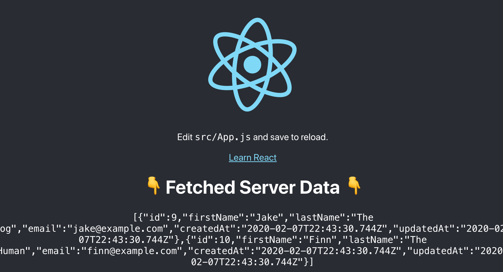

# PERN Stack Boilerplate

This is a boilerplate for a project that aims to use React with Express, Node, and Postgres. Using this boilerplate you should be able to easily develop & deploy a functioning React application that communicates with a API backend written with express.

This boilerplate is deployed on heroku. You can view it [here](https://pern-stack.herokuapp.com/)

#### Happy coding!


## Requirements

- Node (version 10.15.3 or higher)
- NPM
- Postgres - installation instructions [here](https://www.postgresql.org/download/)

## Getting Started

Clone the repo
```bash
git clone https://github.com/edwinthinks/pern-stack-boilerplate.git
```

### Installation Dependencies

In the root directory, install server & client dependencies
```bash
npm run prep
```

Install foreman, nodemon, and sequelize
```bash
npm install -g foreman
npm install -g nodemon
npm install -g sequelize
```

### Setup the database

First modify `server/src/config/config.json` to match your database credentials. Primarily, you should only need to change the username, password, and database values of the development and test keys.

```json
{
  "development": {
    "username": "YOUR_USERNAME",
    "password":  "YOUR_PASSWORD",
    "database": "YOUR_APP_DEVELOPMENT",
    "host": "127.0.0.1",
    "dialect": "postgres",
    "operatorsAliases": false
  },
  "test": {
    "username": "YOUR_USERNAME",
    "password":  "YOUR_PASSWORD",
    "database": "YOUR_APP_TEST",
    "host": "127.0.0.1",
    "dialect": "postgres",
    "operatorsAliases": false
  },
  "production": {
    "use_env_variable": "DATABASE_URL",
    "dialect":"postgres",
    "ssl": true
  }
}
```

Create the database, migrate, and seed with sample data.
```
cd server
npx sequelize db:create
npx sequelize db:migrate
npx sequelize db:seed:all
```

Visit [here](https://github.com/sequelize/cli#usage) for more options or via help:
```
npx sequelize --help
```

### Starting the server & client

Start the client and server in development mode
```bash
npm run develop
```

A browser should open up to [http://localhost:3000/](http://localhost:3000/) with the frontend client loaded.
The server will be hosted on [http://localhost:3001/api](http://localhost:3001/api). You can test
that the server's API is working by accessing [http://localhost:3001/api/users](http://localhost:3001/api/users) and
you should see sample user data.



## Tests

You can run both client & server tests
```bash
npm run test
```

Or optionally you can run the server & client tests separately
```bash
npm run server:test
npm run client:test
```

## Linting

You can run both client & server linting
```bash
npm run lint
```

Or optionally you can run the server & client linting separately
```bash
npm run server:lint
npm run client:lint
```

## Deploying To Heroku

You can deploy projects using this boilerplate to heroku quickly! Here is the steps needed 
to get your project up and running in heroku. 

**Note - this guide assumes you are using the Heroku CLI**

#### Create a Heroku account
Goto [www.heroku.com](www.heroku.com) and register for an account. Free is okay!

#### Install the CLI & create the project
Follow the guide [here](https://devcenter.heroku.com/articles/heroku-cli#download-and-install) to install the Heroku CLI.

Create the heroku project:
```
heroku create
```
#### Add Postgres DB

In the CLI, add the postgres database via:
```
heroku addons:create heroku-postgresql:hobby-dev
```

#### Deploy!
You can now deploy to heroku via push:
```
git push heroku master
```

After deployment you can view the application using `heroku open`. This will open a browser to your deployed project!


